# Los diferentes tipos de imágenes:

Un ejemplo de una imágen de mapa de bits es una fotografía, y un ejemplo de una imágen vectoria sería un dibujo. En GIMP, solo podemos trabajar con imágenes en mapa de bits.

Las Imágenes vectoriales se componen de artículos sueltos. Cada objeto tiene distintas propiedades como color, relleno y tipo de pincelada. Los archivos vectoriales en contraste con las imágenes de mapa de bits, intependientes de la resolucón. Esto ayuda a escalar la imagen hasta alcanzar su máxima calidad.

Un ejemplo hará esto más claro.

# Ilustración Vectorial

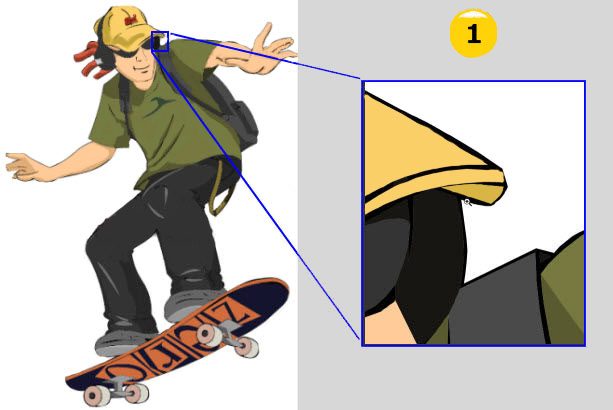

# Imágen de Mapa de Bits 

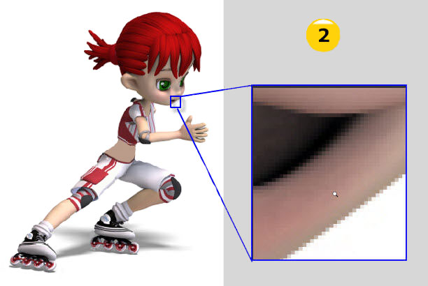

La diferencia es clara cuando acercas la imágen.

En la imágen vectorial todo sigue viendose muy claro (1).
La imágen de mapa de bits se muestra con bloques (2), a los cuales llamamos pixeles.

<!-- <iframe width="560" height="315" src="https://www.youtube-nocookie.com/embed/pbSqU3AdJbM?start=14" title="YouTube video player" frameborder="0" allow="accelerometer; autoplay; clipboard-write; encrypted-media; gyroscope; picture-in-picture; web-share" allowfullscreen></iframe> -->
# Mapa de bits

Las imágenes de mapa de bits (imágenes rasterizadas) que están compuestas por una rejilla o mapa de pequeños cuadrados denominados píxeles.

En un mapa de bits el contenido se representa mediante pequeños puntos rectangulares denominados pixeles. Ampliando lo suficiente una imagen digital (zoom) en la pantalla de un ordenador, pueden observarse los píxeles que componen la imagen.

### <b>DA CLIC A LA IMAGEN PARA VER LA EXPLICACION</b>

⬇️⬇️⬇️⬇️⬇️⬇️⬇️⬇️⬇️⬇️⬇️⬇️⬇️⬇️⬇️⬇️⬇️

# Imágenes Vectoriales

Las imágenes vectoriales se componen de líneas y curvas definidas matemáticamente.
Una imagen vectorial es una imagen digital formada por objetos geométricos independientes (segmentos, polígonos, arcos, etc.), cada uno de ellos definido por distintos atributos matemáticos de forma, de posición, de color, etc. Por ejemplo, un círculo de color rojo quedaría definido por la posición de su centro, su radio, el grosor de línea y su color.

El interés principal de los gráficos vectoriales es poder ampliar el tamaño de una imagen a voluntad sin sufrir la pérdida de calidad que sufren los mapas de bits. De la misma forma, permiten mover, estirar y retorcer imágenes de manera relativamente sencilla.
# Configuración nuevo proyecto en photoshop

✅ Photoshop maneja tamaños predeterminados. Nos ayuda a ahorrar tiempo y nos brinda información exacta.

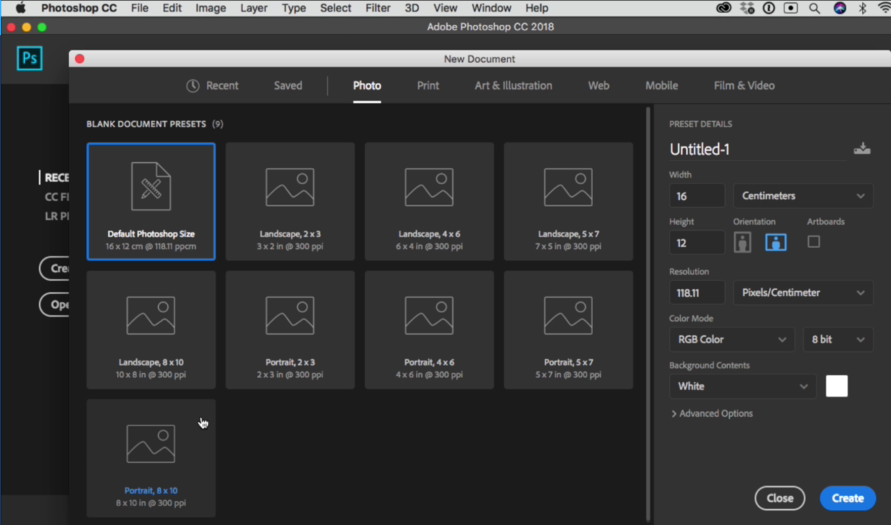

<b>RESOLUCIÓN DE DOCUMENTO:</b>

*Siempre debemos preguntarnos ¿para qué estamos trabajando?*

**La medida ideal** en PPP (Pixeles Por Pulgada) para dispositivos digitales es de 72 PPP y de 300 PPP para impresión, especialmente a gran escala.

* <i>**Impresión:** 300 pixels/inch</i>
* <i>**Digital:** 72 pixels/inch</i>

<b>MODO DE COLOR:</b>

*Siempre debemos preguntarnos ¿para qué estamos trabajando?*

**El perfil de color** ideal para impresión es el CMYK (que son los colores Cian o “azul claro”, Magenta o “rosa”, Yellow “amarillo” y Black “negro”) y para digitales sRGB o RGB ( RED rojo, GREEN verde y BLUE azul) para que no haya mucha diferencia de colores entre dispositivos.

* <i>**Impresión:** CMYK || 16 bits = **C**ian - **M**agenta - **Y**ellow - blac**K**</i>
* <i>**Digital:** RGB || 16 bits = **R**ed - **G**reen – **B**lue</i>

<b>PERFIL DE COLOR:</b>

* **En RGB:** sRGB IEC61966-21
* **En CMYK:** COATED FOGRAF 39
* **8 Bit:** Digital
* **16 Bit:** Fotografía

**ASPECTO DEL PÍXEL:**

<i>Por los televisores de antes, se debía definir la forma del pixel, pero ahora todos son cuadrados.</i>

# Espacio De Trabajo: Paneles y Herramientas de Photoshop

# BARRA DE HERRAMIENTAS DE LA IZQUIERDA

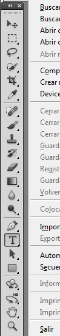

* Se trabaja comúnmente con las herramientas preseleccionadas.
* Hay herramientas que tienen más herramientas dentro de sí.

# BARRA DE HERRAMIENTAS DE LA DERECHA

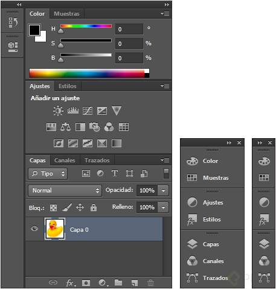

* Los paneles de herramientas, están divididos en pestañas.
* Los paneles son son configurables en su tamaño y ubicación.

# WINDOWS | VENTANA

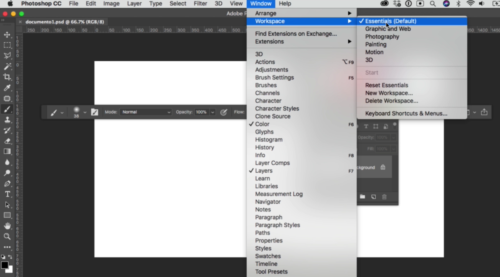

* Muestra y detalla todas las herramientas principales.
* Muestra con una check las ventanas activas de nuestros paneles.

# BARRA SUPERIOR

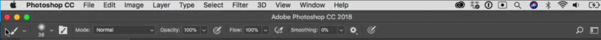

* Muestra propiedades de la herramienta que tenemos seleccionada.
* Todos los paneles son configurables y colapsables.

✔ Organizar espacio de trabajo: Windows → workspace / espacio de trabajo:

✔ Photoshop permite, de manera ordenada, trabajar con varios documentos por medio de pestañas.

# Los paneles de Photoshop 

La barra de paneles agrupa las funciones que Photoshop es capaz de realizar según sus características:

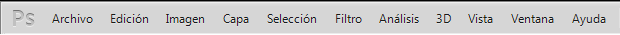

# Panel Archivo:
En el panel Archivo encontraremos funciones referentes a nuestro documento, como nuevo, abrir, cerrar, guardar, exportar, etc.

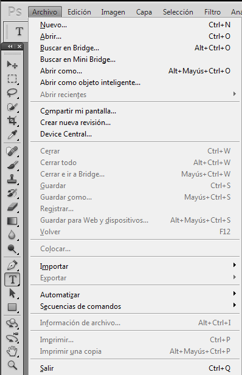

# Edición:

Agrupa las funciones para editar capas o objetos de nuestro documento. Desde esta ventana podemos entre otras cosas: copiar, cortar, pegar, deshacer y escalar.

# Panel Capa:
Son las funciones para creación y manipulación de capas con opciones como: nuevo, duplicar, borrar, agrupar, organizar, etc.

**Panel Selección:**

Aquí encontramos las funciones para seleccionar todo en una capa, deseleccionar, crear máscaras, etc.

# Panel Filtro:
En este panel están todos los filtros que Photoshop puede aplicar. Un filtro es una función que realiza una serie de acciones sobre el documento para añadirle un efecto como que una foto se vea como si estuviese pintada a mano. Existe una gran cantidad de filtros con los que se puede ir jugando.

El panel filtros y el resto de paneles que no hemos explicado, no se verán en este tutorial.

# Panel Ventana:
Este panel es muy importante y a veces poco conocido. Desde aquí abriremos otras ventanas que tienen su propio panel de control desde donde poder trabajar más opciones de una misma herramienta.

En ocasiones, podemos querer cerrar algunas de las ventanas o bien, la habremos cerrado sin querer, en ese caso acudiremos al panel Ventana para volver a abrir aquellas que necesitemos o hubiésemos cerrado accidentalmente.

# Las herramientas del Photoshop
En cualquier oficio es indispensable disponer de las herramientas adecuadas para su desarrollo sin embargo, Photoshop no es cualquier oficio y dispone de una gran cantidad de ellas para realizar una gran cantidad de cosas.

Como en todo oficio comenzaremos hablando de las herramientas elementales para ir perfeccionando a lo largo del tiempo hasta otras más complejas. Antes de empezar a crear, debemos saber de qué herramientas disponemos y qué podemos hacer con ellas.

# Herramientas Habituales

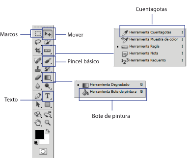

# Herramienta Mover:
Esta herramienta es la que usaremos para mover cualquier cosa mientras estamos trabajando.

# Selección de marcos:
Disponemos de distintas formas geométricas con las que realizaremos la selección, como un rectángulo o una elipse. Si no elegimos ninguna utilizará la forma rectangular para realizar la selección.

# Cuentagotas:
Esta herramienta nos permite seleccionar un color que haya en la imagen.

# Pincel básico:
Como la selección de marcos también tiene varias opciones para elegir, en esta entrega utilizaremos el pincel pero la explicación sirve también para el lápiz.

Cuando seleccionamos una herramienta se muestralas opciones que tiene. La herramienta pincel simula un pincel real y sirve para hacer trazos. Podemos seleccionar el grosor y la intensidad, es decir más o menos suavidad a la hora de pintar.

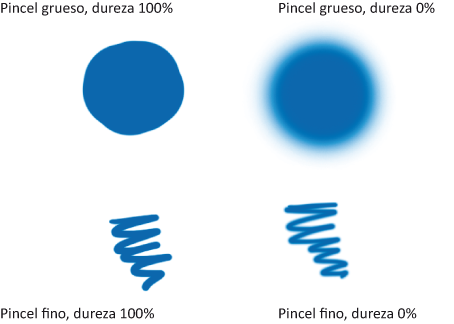

# Bote de pintura:
Esta herramienta cambia el color de una zona. Las zonas se forman por colores, así si un borde es blanco, todo el borde será una zona blanca.

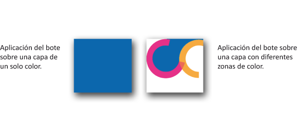

# Texto:
Esta herramienta crea una nueva capa de texto directamente en nuestro documento.

# Administrador de archivos

El manejo de archivos es algo que ya se ha estado manejando en cada una de las fases que has tomado. A continuación se da la descripcion y método abreviado de cada una de ellas.

|**Comando**|**Método abreviado**|**Descripción**|
|--|--|--|
|**Abrir**|Ctrl + O|Permite abrir un archivo existente.|
|**Guardar**|Ctrl + S|Guarda el archivo actual.|
|**Guardar como**|Ctrl + Shift + S|Guarda el archivo especificado un nombre y una ubicación.|
|**Nuevo**|Ctrl + N|Permite crear un archivo.|
|**Cerrar**|Ctrl + W|Cierra un archivo.|
|**Salir**|Ctrl + Q|Cierra el programa.|

Cabe mencionar que cada una de estas opciones se encuentra en le menú de **Archivo**

La extención con la que se guardan los archivos de *Photoshop* es .PSD y .PDD (*Archivos sin terminar*); sin embargo, las imagenes se pueden guardar en cualquiera de los siguientes formatos:

# Formatos de archivo de Photoshop

Photoshop soporta más de 20 formatos de archivo. Desde el cuadro de diálogo de “Abrir” y “Guardar” podemos ver los distintos formatos que soporta. Puede soportar incluso más formatos mediante la adición de plugins que añaden comandos a los submenús “Guardar cómo”, “Importar” y “Exportar” del menú Archivo.

# Los formatos más utilizados son:
**PSD, PDD:** formato estándar de Photoshop con soporte de capas.

**PostScript:** no es exactamente un formato, sino un lenguaje de descripción de páginas. Se suele encontrar documentos en PostScript. Utiliza primitivas de dibujo para poder editarlo.

**EPS:** es una versión de PostScript, se utiliza para situar imágenes en un documento. Es compatible con programas vectoriales y de autoedición.

**DCS:** fue creado por Quark (empresa de software para autoedición) y permite almacenar tipografía, tramas, etc. Se utiliza para filmación en autoedición.

**Prev. EPS TIFF:** permite visualizar archivos EPS que no se abren en Photoshop, por ejemplo, los de QuarkXPress.

**BMP:** formato estándar de Windows.

**GIF:** muy utilizado para las webs. Permite almacenar un canal alfa para dotarlo de transparencia, y salvarlo como entrelazado para que al cargarlo en la web lo haga en varios pasos. Admite hasta 256 colores.

**JPEG:** también muy utilizado en la WWW, factor de compresión muy alto y buena calidad de imagen.

**TIFF:** una solución creada para pasar de PC a MAC y viceversa.

**PICT:** desde plataformas MAC se exporta a programas de autoedición como QuarkXPress.

**PNG:** la misma utilización que los GIF, pero con mayor calidad. Soporta transparencia y colores a 24 bits. Solo las versiones recientes de navegadores pueden soportarlos.

**PDF:** formato original de Acrobat. Permite almacenar imágenes vectoriales y mapa de bits.

**IFF:** se utiliza para intercambio de datos con Amiga.

**PCX:** formato solo para PC. Permite colores a 1, 4, 8 y 24 pixels.

**RAW:** formato estándar para cualquier plataforma o programa gráfico.

**TGA:** compatible con equipos con tarjeta gráfica de Truevision.

**Scitex CT:** formato utilizado para documentos de calidad profesional.

**Filmstrip:** se utiliza para hacer animaciones. También se puede importar o exportar a Premiere.

**FlashPix:** formato originario de Kodak para abrir de forma rápida imágenes de calidad superior.

# Cómo guardar un archivo de Photoshop y extensiones de archivo

Guardaremos el documento ahora y posteriormente utilizaremos la combinación de teclas Ctrl + S (comando + S) en MacOS. En cualquier caso, el procedimiento para guardar el documento es el siguiente:

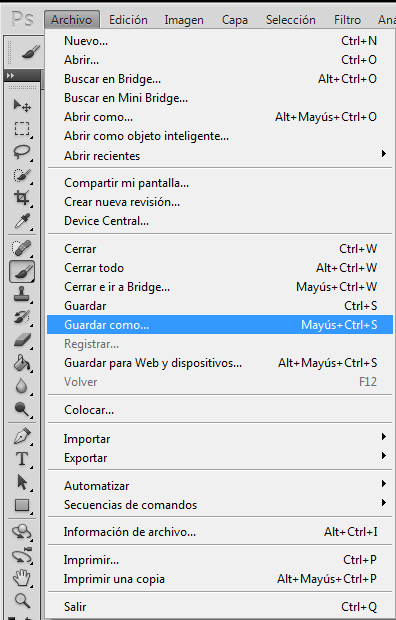

En el panel Archivo hacemos click en la función Guardar como. La ventana «Guardar Como…» es la que nos indica la ruta (sitio donde se guarda el fichero PSD) y el formato (tipo de archivo de trabajo que será normalmente Photoshop) en que guardaremos nuestro documento.

En cuanto al formato, comentaremos algunos tipos de formatos más típicos para las páginas web y el nativo de Photoshop. Usaremos uno u otro según su finalidad.

# Archivos PSD
El archivo .PSD es el formato nativo de Photoshop y será nuestro archivo abierto de trabajo. Esto significa que nos mantendrá las capas, el texto, los efectos, las distintas imágenes, todo por separado, sin acoplar. Este archivo será el que guardemos durante el proceso de trabajo para poder abrir y modificar en cualquier momento.

# La extensión PNG:
Este es un formato web que nos conviene utilizar en los casos en que nuestros banners estén compuestos por transparencias, aunque su uso es también recomendable para imágenes con colores planos, es decir, pocos colores en total, todo lo contrario que una foto.

# Extensiones GIF:
Este también es un formato típico de web y lo utilizaremos, sobre todo, cuando tengamos que crear una secuencia de imágenes. Al igual que el .PNG permite transparencias, pero de menor calidad. Es recomendable para colores planos y sin fotos, pero no aguanta las transparencias tan bien como el .PNG, con lo cual lo podremos elegir en imágenes con colores planos que no necesiten transparencia. Normalmente el archivo .GIF suele pesar menos que él .PNG y por ello es más conveniente según qué casos.

# Formatos JPG:
Utilizaremos este formato para los banners que tengan fotos, solas o con otros elementos gráficos, porque en este caso un .JPG bien optimizado pesa mucho menos que un .PNG.

# Shorcuts Photoshop

👉[HAZ CLIC AQUI](https://helpx.adobe.com/es/photoshop/using/default-keyboard-shortcuts.html)👈

# Capas: Que son las capas de Photoshop y cómo trabajar con las capas

Las capas de Photoshop semejan hojas apiladas de acetato. Puede ver las capas que se encuentran debajo a través de las áreas transparentes de una capa. Cuando creamos un archivo nuevo, en la ventana capas veremos que ya existe una capa y que se llama Fondo.

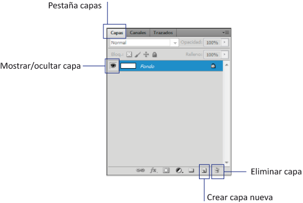

Con cada nuevo elemento añadiremos una capa nueva y también lo haremos al usar cualquier herramienta. Ciertas herramientas, al usarlas sobre el documento, ya **nos añaden su propia capa**, como por ejemplo la herramienta de texto. Sin embargo, otras, como el bote de pintura o los pinceles no lo hacen.

Por ello antes de usar estas herramientas debemos crear una nueva capa para no actuar sobre la existente. Las capas nos permiten añadir efectos, transparencias, hacer fusiones entre varias capas y otras muchas cosas. **¿Y qué conseguimos al tener nuestro archivo montado en capas?**

Conseguimos tener un documento de trabajo abierto a posibles **modificaciones** futuras, que nos facilitarán el trabajo y nos evitarán tener que rehacer toda una imagen o hacer algún arreglo rápido, para cambiar un simple texto o borrar un gráfico que ya no nos gusta.

Un documento cerrado y listo es lo que se llama Arte final. Para modificaciones futuras, utilizaremos el archivo .PSD que es que el llevaremos guardando durante todo el proceso de trabajo.

# Tipos de capas

Photoshop genera diferentes tipos de capas de manera predeterminada; al crear una capa se maneja como mapa de bits pero al momento de utilizar texto, o bien colocar una imagen, se crea su **Tipo de capa.**

* **Fondo:** Se genera cuando abre una imagen, o bien se crea un documento nuevo, y se está trabajando directamente en ella; cabe senalar que, mientras sea un fondo, se mantendrán bloqueadas las propiedades que tenga, como la opacidad, eI relleno, etcétera.  
Para desbloquear Ia imagen, basta con dar doble clic sobre ella y entonces
se convierte en "capa cero".

* **Objeto inteligente:** Los objetos inteligentes se encuentran en capas que contienen datos de imágenes rasterizadas o vectoriales; por ejemplo, archivos de Photoshop o Illustrator. Los objetos inteligentes conservan el contenido original de la imagen con todas sus caracteristicas originales. de tal manera que posibilitan la edición no destructiva de la capa. Los objetos inteligentes se pueden crear de varias formas: con el comando **Abrir como objeto inteligente**, mediante la colocación de un archivo, al pegar datos de Illustrator.

* **Formas:** Conservan las formas vectoriales creadas con las herramientas de Forma o con las de Pluma. En realidad, es una capa de relleno con un trazado de recorte de capa. La primera define el color de la figura vectorial, y el trazado define su contorno.

* **Capa de texto:** Se genera una nueva capa de texto cada vez que se inserta texto, de forma automatica se nombra con los caracteres escritos. Estas capas son transparentes, salvo el área cubierta por el propio texto. Estas capas son especiales, no son modificables como las de imagen. no se puede pintar sobre ellas, por ejemplo. Cuando se estå seguro de que no se va a querer modificar el texto y que éste es definitivo se puede convertir la capa de texto a una capa de imagen. Para esto active el menú **Capa** opción **Rasterizar texto.**

# Panel de capas

El Panel de Capas permite controlar y gestionar todas las capas. El orden en el que aparecen las capas indica su orden real de apilamiento.La capa activa se visuahza en azul. La casilla situada más a la izquierda, que muestra un icono en forma de ojo, es la que controla la visibilidad. Haciendo cltc sobre eI ojo. la capa se oculta. y si estå ocuita, al hacer clic se visualiza. En la barra de abajo de la paleta Capas hay botones para:

* Ariadir estilo de capa
* Ariadir máscara de capa
* Crear grupos
* Crear capa de relleno a ajuste
* Crear capa y eliminar capa